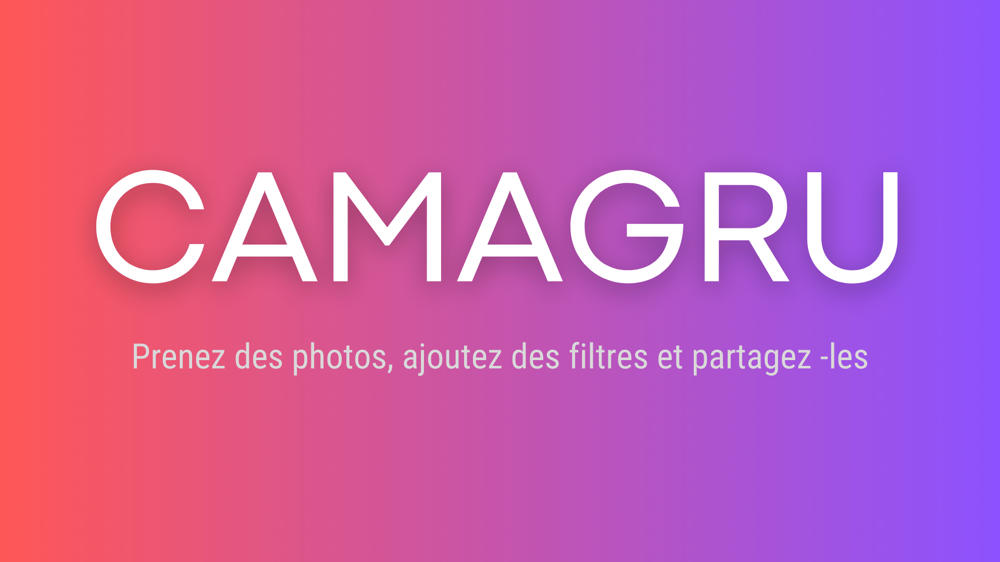

# Camagru



## 📷 Description

Camagru est une application web permettant aux utilisateurs de créer et partager des photos avec des filtres et stickers. Ce projet fait partie du cursus web de l'école 42.

## ⚙️ Fonctionnalités

- Création de compte utilisateur sécurisé
- Capture de photos via webcam
- Application de filtres et stickers en temps réel
- Gallerie de photos partagées
- Système de likes et commentaires
- Notifications par email

## 🛠️ Technologies utilisées

- Frontend: HTML5, CSS3, JavaScript (Vanilla)
- Backend: PHP
- Base de données: MySQL
- Serveur: Nginx/Apache

## 🚀 Installation

```bash
# Cloner le dépôt
git clone https://github.com/votre-username/camagru.git

# Se déplacer dans le dossier
cd camagru

# Configuration (si docker-compose disponible)
docker-compose up -d
```

## 💡 Configuration

1. Renommer `config/database.sample.php` en `config/database.php`
2. Configurer vos paramètres de base de données
3. Configurer les informations SMTP pour l'envoi d'emails

## 📝 Normes du projet

Projet réalisé selon les normes de l'école 42:
- Pas de framework (sauf micro-frameworks CSS)
- Site responsive
- Compatible avec Chrome et Firefox
- Validation W3C

## 🔒 Sécurité

- Protection contre injections SQL
- Mots de passe hachés
- Protection CSRF
- Validation des données utilisateur

## 👤 Auteur

- phudyka

---
*Projet réalisé dans le cadre du cursus à l'école 42*
